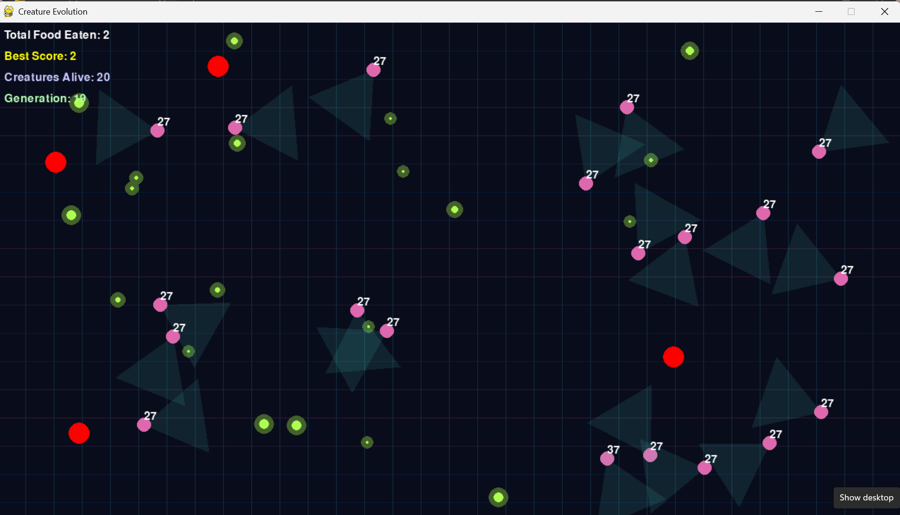

# Creature Lab

Creature Lab is a Python/Pygame evolutionary simulation where simple agents learn over generations through selection and mutation.

The simulation contains two types of agents:

- Creatures search for food, avoid predators, gain energy, and reproduce through evolved brains.
- Predators chase creatures, gain energy by catching them, and evolve separately.

Over time, simple rules can create emergent behavior such as better food seeking, predator chasing, and predator avoidance.



## Features

- Multi-agent creature and predator simulation
- Neural-network based movement decisions
- Evolution through parent selection, brain copying, and mutation
- Separate brains for creatures and predators
- Food collection, energy loss, death, and generation reset
- Predator sensing input for creatures
- Predator hunting behavior
- Survival-time based scoring support

## Tech Stack

- Python
- Pygame
- NumPy

## How To Run

Install dependencies:

```bash
pip install pygame numpy
```

Run the simulation:

```bash
python main.py
```

## Project Structure

```text
creature_lab/
  main.py
  creature.py
  creature_brain.py
  predator.py
  predator_brain.py
  README.md
```

## File Overview

- `main.py`: starts Pygame, runs the simulation loop, handles generations, and draws agents.
- `creature.py`: handles creature creation, movement, food eating, survival, death, and evolution.
- `creature_brain.py`: neural network used by creatures.
- `predator.py`: handles predator creation, movement, hunting, death, and evolution.
- `predator_brain.py`: neural network used by predators.

## How Evolution Works

Each generation runs for a fixed time. During the generation:

1. Creatures try to survive, eat food, and avoid predators.
2. Predators try to catch creatures.
3. Agents gain score from successful behavior.
4. At the end of the generation, the best agents are selected as parents.
5. Children copy parent brains with small random mutations.
6. The next generation starts with the mutated children.

This process allows behaviors to improve over time without manually coding every strategy.

## Current Learning Signals

Creatures can use inputs such as:

- nearest food direction
- nearest food distance
- nearest predator direction
- nearest predator distance
- current energy
- map position

Predators can use inputs such as:

- nearest creature direction
- nearest creature distance
- current energy
- map position

## Notes

This is an experimental project for exploring evolutionary learning, neural networks, and emergent behavior in a simple ecosystem.
